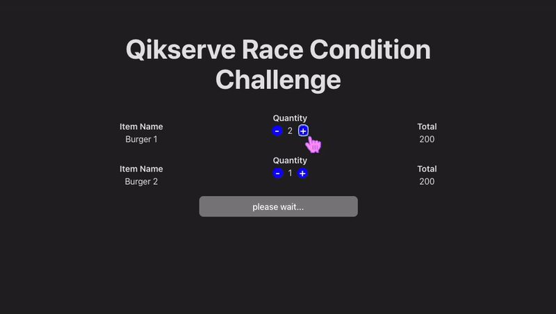

# Solution

<h4 align="center"><a href="https://race-condition.netlify.app/" target="_blank">Live Preview</a></h4>

  

## Summary of Changes
The main changes include:

 - **Debounce for API Requests**: The lodash library was installed to implement a debounce function (`debounceValidateBasket`). This avoids the race condition by limiting the frequency of API requests to validate the cart.

 - **Maintaining Calculation State**: the variables (`pendingUpdate`, `lastUpdateTotal`, `lastUpdateTimestamp`) was added to track the state of the latest update and ensure the cart total is correctly updated with the latest API response.
While a request is in progress, if new changes occur, they will be processed after the current request is completed, ensuring the cart state is always consistent!

- To **reduce code repetition**, the `updateItemQuantity` function was added abstracting the logic of the `incrementItem` and `decrementItem` functions.

## Solution's rules
- :white_check_mark: We don't want to disable Plus & Minus button while the request is being done
- :white_check_mark: If i click twice in a Plus or minus button, i want the application to make only 1 request
- :white_check_mark: If i click on minus or plus button while the request is being done, another request should be done as soon as the current one finishes
- :white_check_mark: Checkout button should be disabled while those 2 requests are not finished.
- :white_check_mark: We need to know the value of response of latest started request.
- :white_check_mark: The latest started request is not always the latest finished request

## Project stack
- Vite
- React 16
- Redux

## Run instructions
- nvm use
- npm install
- npm run dev

